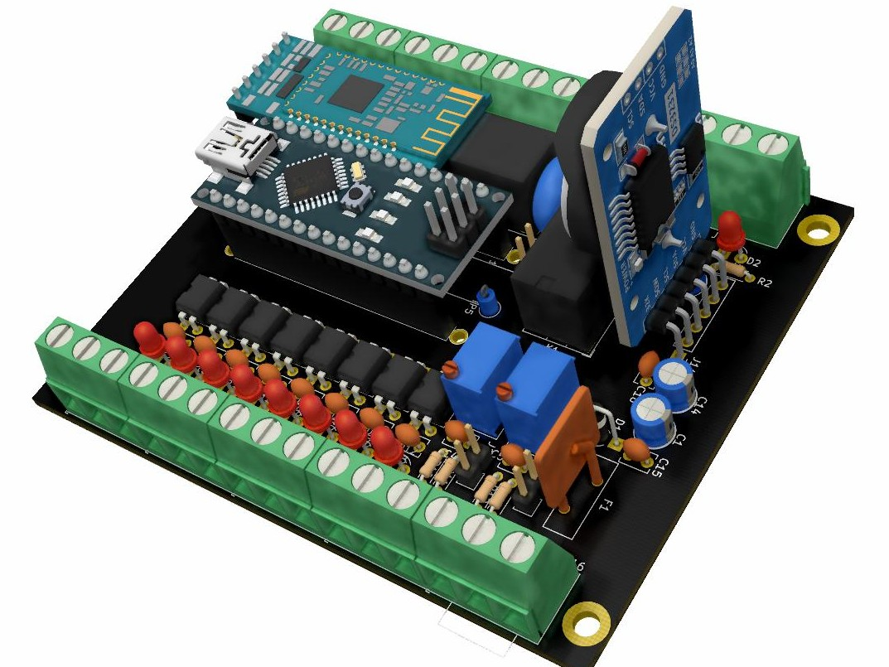
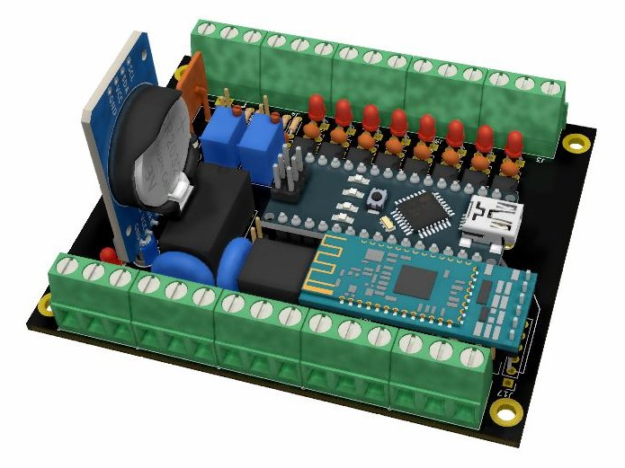

NANO5_PLC
===========
  Design and (C) 2021 RJLabs Innovation <rjlabs.innovation@gmail.com> 
  
  Provided under the terms of the CC0 1.0 Universal license.

Overview
--------
  This design board is based Outseal PLC V.5 [Outseal Website](http://www.outseal.com/web/produk). The main goal of this project to provide sigle side PCB that can be produce in house using transfer paper or negatif film method.

Key Feature
-------- 
* 2 Analog Input 0 - 20mA Or 0 -5V
* Built-in Modbus RTU
* Built-in external EEPROM 24CXX
* 8 Isolated Digital Input (12V - 24V)
* 2 Relay On Board with Surge Protection
* 6 Open Colector Digital Output
* Add On RTC DS3231 & Bluethoot HC05/06 

TODO
--------
* Add Regulator input power From LDO using Switching fore wide input voltage
* Add filter On input power stage
*

FINAL PRODUCT 3D RENDER
--------

  

Donations
--------
To support this project, you can make a donation to its current maintainer:

